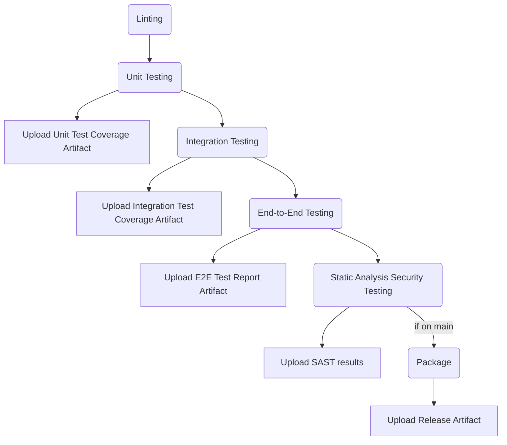
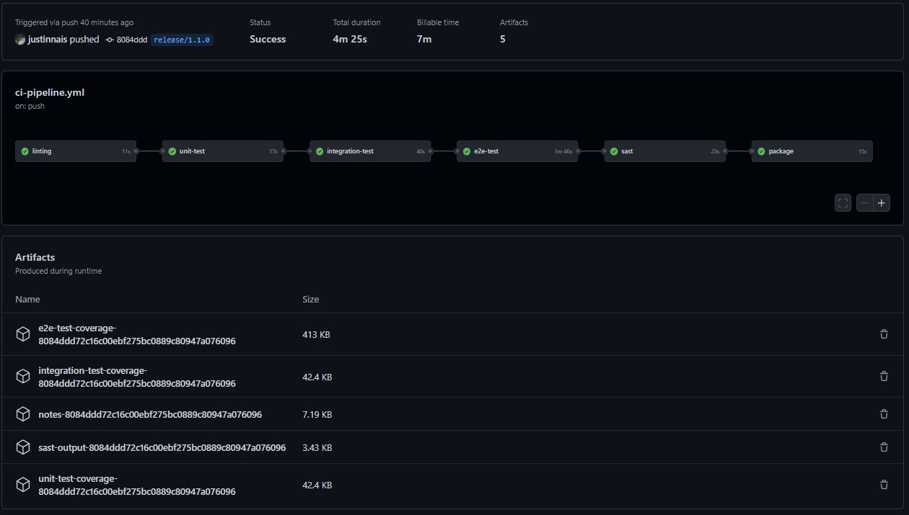
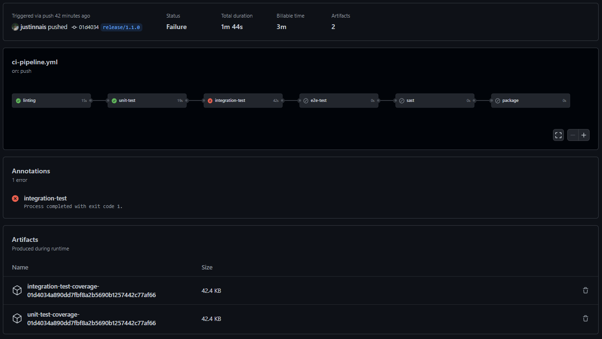
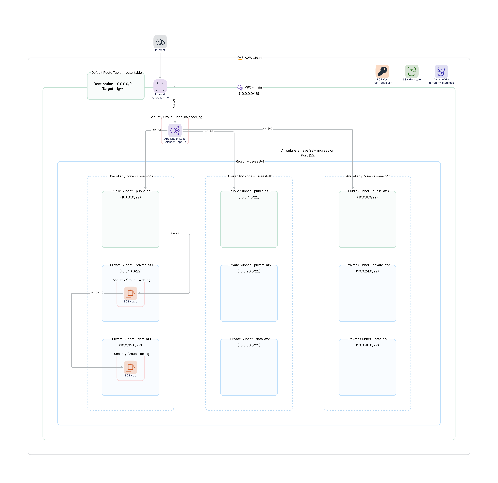

# Alpine Inc 🗻

Created by **Justin Naismith**

The following analysis was done for System Deployment and Operations at RMIT University. This was completed over two assignments but has been combined into one repository for visibility.

- Part 1 covers the setup of a Continuous Integration pipline using GitHub Actions - 100%
- Part 2 implements Infrastructure as Code using Terraform and AWS - 94%

# Part 1

## Analysis of the problem

> Alpine Inc's current development strategy has a numerous problems that need to be addressed. These issues are affecting vital customer deliveries, employee satisfaction, and Alpine Inc's bottom line.

**Key issues include:**

### 1. Application is manually built and deployed

The notes application relies on a manual process to build and deploy. This can introduce bugs due to different environments depending on the device this takes place on. It is also a waste of time resources, using developer time on a process that can be automated.

### 2. Build and deployment from a single laptop.

By building and deploying from a single device, Alpine Inc is introducing a single point of failure within their development process.

That device is prone to environment variables changes (e.g. Node version) and operating system updates which can create bugs and inconsistencies when building. It can also be unavailable, offline, or broken. This results in no deployments going out until the device is back working.

We can see how this has affected Alpine Inc and it's customers when the lead developer was on leave. Work halted and a client missed a critical release.

### 3. Increase of bugs in production.

The amount of bugs making it through to production is having a negative impact on client and employee satisfaction.
Having developers focus on support calls is taking away time from day to day processes. This is resulting in overtime for staff, which is bad for moral and costing the business financially.

This is an indication of a not enough testing, or ineffective testing.

## Solution

We will create a CI pipeline to resolve the above issues. An automated pipeline will remove the need for a developer to manually run the build, package and deploy the application. This gives them time back to focus on providing value for the business and its clients.

By creating a pipeline using a CI/CD platform such as GitHub actions, the process is completed right in the Alpine Inc repository, removing the dependency on the lead developers laptop. This could be run from anywhere by any developer with appropriate privileges, or even better - automated based on events like pull requests and releases.

There needs to be a stronger focus on testing to minimise the bugs being pushed to production. We will automate our:

- Unit testing
- Integration testing
- End-to-end testing

We will be reporting our code coverage as well to ensure our entire codebase is being tested, helping us to identify where we are missing tests.

We will also add linting rules to the repository to ensure consistent code style throughout the team.

### Pipeline

The pipeline contains the following stages:

1. Linting

   > Linting uses ESLint to analyse the codebase for bugs, easy to miss errors, and style inconsistencies. If there are any errors created due to rules set in our `.eslintrc.yml`, the pipeline will fail and break the build.

2. Unit Testing

   > Unit testing uses Jest to check that individual functions work as intended, isolating the code and ensuring its correctness. We also check the code coverage, to make sure we are keeping up with our unit tests. This is uploaded as an artifact when the pipeline runs. If any of our unit tests fail, the pipeline will fail and break the build.

3. Integration Testing

   > Integration testing also uses Jest, but to check that when the individual units are combined into the whole system, they all work as intented together. For example, our pipeline sets up a Mongodb docker container to host our server, and we check that works to create notes and redirect the user, as we intend in our code. This will also upload a code coverage artifact when run, and will break the build on failure of any tests.

4. End-to-end Testing

   > End-to-end testing makes use of Playwright to simulate to process of a real user operating the system. Just as a user would, it navigates the site, looking for inputs or text to guide it, and entering data. This also uploads test results as an artifact, and breaks the build on test failure.

5. Static Analysis Security Testing
   > Static Analysis Security Testing checks the code for any security vulnerabilities. We are using nodejsscan to check our Node application for any issues. We are breaking the build if there are any security issues in the report.
6. Package
   > Package creates a tarball of the Node application which we upload on changes to the main branch as an artifact.

Each stage relies on the previous to succeed:



### Success Scenario

If there are no issues in our pipeline, it will return a `success` status. It will package the application if it is on the main branch.



### Failure Scenario

Our CI pipeline will break the build if any of these steps fail, preventing buggy code from entering our releases.

Here is an example:

> The integration test was setup to fail, and the pipeline will stop on this step, returning a `failure` status. It also uploads to code coverage artifacts of the failed tests.



# Part 2

## Analysis of the problem

> Alpine Inc's current deployment strategy is known as **'ClickOps'**. This is an inefficient and inacccurate way to build the infrastructure their products exist on.
>
> It involves a developer _clicking_ through the often clunky user interface of cloud providers like Amazon Web Services (AWS). This can lead to numerous issues.

**Key issues include:**

### 1. Inefficient

Traversing through the UI of AWS is time-consuming, due to:

- Point and click. Finding where to click and moving your cursor will always be slow
- Large number of services available, often with significant UI differences
- Many pages of service configuration to create a single service
- Drift between documentation screenshots and current versions

All of these factors consume large amounts of developer time when setting up infrastructure.

### 2. Error Prone

Everyone makes mistakes, so getting a developer to setup even a small amount of infrastructure through ClickOps will result in errors that can be hard to troubleshoot and potentially very costly.
One recursive lambda invocation and the next AWS bill is not pretty.

This also poses an issue in a disaster recovery situation. If our infrastructure goes down, how can we accurately rebuild it? Even if we do manage to do so, how long did it take?

### 3. Lack of History

Infrastructure changes to a cloud console can be tracked, but trawling through logs is not as easy as looking at a Git diff. There is also no explanation of _why_ a change was made to the infrastructure, making it difficult to know why a certain service exists, or why it is configured that way. A developer may not want to adjust the settings of an existing service in fear they will bring down production.

## Solution

We will be making use of **Infrastructure as Code (IaC)** to solve the above issues.

Infrastructure as Code allows us to provision cloud resources by writing code. Writing IaC allows us to create, update and delete our network, servers, instances and more, all without having to open the clunky UI of our cloud provider. We will have the ability build up and tear down our entire stack in the span of minutes, as opposed to what would normally be many hours with ClickOps.

Just like the rest of our code, it can be stored in our source control, GitHub. This provides us with an accurate and easy to read history of changes made to our infrastructure. They will also require Pull Requests to enter our repo and pipelines, ensuring that changes are well explained and reviewed by other developers.

AWS has their own IaC platform, CloudFormation, however we have chosen to use HashiCorp's Terraform due to its flexibility between cloud providers, allowing us to migrate to another provider in the future without having to relearn their in-house syntax.

No screenshot of application due to Ansible issues.

## Architecture

Our architecture is built with Amazon Web Services.

> 
>
> Created with [onemodel](https://www.onemodel.app/)

Resources we are provisioning include:

- VPC

  > The Virtual Private Cloud is deployed into CIDR block `10.0.0.0/16`. This is where we launch our other resources into.

- Availability Zones

  > We are operating within three Availability Zones:
  >
  > - `us-east-1a`
  > - `us-east-1b`
  > - `us-east-1c`
  >
  > <br>These three data centers allow us to spread out the load from our inbound traffic, with load balancers in all three. We deploy our EC2 Instances to `us-east-1a` but are ready to quickly replicate to the other two if required.

- Subnets

  > We have nine Subnets, three in each Availability Zone. Our public, private and data subnets are:
  >
  > - `public_az1`, `public_az2`, `public_az3`
  > - `private_az1`, `private_az2`, `private_az3`
  > - `data_az1`, `data_az2`, `data_az3`
  >
  > <br>Note the limitations of this assignment mean all subnets are public, where normally private and data subnets would be private.

- Internet Gateway
  > The Internet Gateway allows our VPC to send and receieve traffic from the internet.
  >
  > We also use Route Tables to control network traffic and direct it to the IGW.
- EC2 Instances
  > EC2s are virtual environments that we deploy our applications to.
  > We have:
  >
  > - Web application instance
  > - Database instance
  >
  > <br>Both instances are running on the latest Amazon Linux AMI.
- Security Groups
  > Security groups act as virtual firewalls to control inbound and outbound traffic.
  > We have security groups for our:
  >
  > - Load balancers
  > - Web application instance
  > - Database instance

We also have an S3 Bucket and DynamoDB table for our Terraform state file, allowing multiple developers to work on the infrastructure at the same time without conflicts.

## Deployment Steps

### Prerequisites

To run the application locally, you must first install the following packages in your linux environment:

**Make**

```
sudo apt install make
```

**[Terraform](https://learn.hashicorp.com/tutorials/terraform/install-cli)**

```
sudo apt-get update && sudo apt-get install -y gnupg software-properties-common curl
curl -fsSL https://apt.releases.hashicorp.com/gpg | sudo apt-key add -
sudo apt-add-repository "deb [arch=amd64] https://apt.releases.hashicorp.com $(lsb_release -cs) main"
sudo apt-get update && sudo apt-get install terraform
```

**[Ansible](https://docs.ansible.com/ansible/latest/installation_guide/intro_installation.html#installing-ansible-on-ubuntu)**

```
sudo apt update
sudo apt install software-properties-common
sudo add-apt-repository --yes --update ppa:ansible/ansible
sudo apt install ansible
```

### Initial Setup

For first time setup, you will have to:

1. Get your AWS access key and token from your environment
1. Add AWS keys to `~/.aws/credentials`
1. Run `make ssh-gen` to create your EC2 keys
1. Run `make bootstrap` to create a Terraform remote state
1. Add the output details into `backend "s3"` inside `infra/main.tf`
1. Run `make infra-init` to initialise your Terraform state

### Run

To build your infrastructure and deploy your app, run `make all-up`

This will build AWS resources using Terraform, then runs an shell script that uses Ansible to setup the web and database EC2 instances.

ALternatively, you can break these steps up individually with `make infra-up` and `make ansible-up`

### Teardown

To destroy all your provisioned resources and take the app offline, run `make infra-down`

## Limitations

### Database

For our database, we are using **MongoDB**. We are deploying this to a single EC2 instance.

The main issues with deploying to a single instance are:

1. Data loss in event of disaster

   > We want to ensure we are redundant by replicating our database across instances in different availability zones. We have provisioned our subnets into the three availability zones, `us-east-1a`, `us-east-1b`, `us-east-1c`, so we should make use of these and deploy replicas to them.

1. Poor performance in high-load situations

   > If we encounter a large amount of traffic, our database will perform poorly due to having a single `t2.micro` instance. We can resolve this by upgrading the tier we are using, and/or scaling out our database to other instances. We can also use auto-scaling to scale up our instances when encountering unusually heavy traffic.

Alternative options to running our database in EC2 instances are:

1. AWS DocumentDB

   > Migrate database to DocumentDB, which uses the same APIs as MongoDB. Details on how to migrate can be found [here.](https://docs.aws.amazon.com/documentdb/latest/developerguide/docdb-migration.html)

1. MongoDB Atlas

   > [Atlas](https://www.mongodb.com/atlas) is a fully-managed cloud database that handles the complexity of managing and deploying the database. It handles the clusters and deals with replication in multiple regions ensuring low latency and data redundancy.

### Other

We encountered some other limitations with the new infrastructure setup.

1. AWS Secret Expiry

   > We are storing our AWS secrets in GitHub Secrets, ensuring that they are not being commited to our repository. However, due to the limit on our AWS Console, they expire every 4 hours. <p>This means we have to manually update our secrets. This would not be an issue with a normal AWS environment.<p>To make this easier, we created a Shell script that updates the secrets automatically when run. This requires [GitHub CLI](https://cli.github.com/). Run it with `make update-credentials`. Note - make sure your `~/.aws/credentials` file has your latest secrets in it.

1. Key Generation

   > Our GitHub Actions pipeline generates a new key-pair for our EC2s every time it runs. The makes Terraform destroy and recreate the `rmit-assignment-2-key` everytime it applies.

1. Diagrams as Code

   > We attempted to use [Diagrams as Code](https://diagrams.mingrammer.com/) to generate AWS diagrams from our Terraform state. With a bit of transformation some progress was made, however the limitations of Diagrams (not possible to link two lists together) meant we went back to a manual diagram.
   >
   > 

1. Private Subnets

   > The subnets that we deploy our EC2 instances to are `private_az1` and `data_az1`. These do not output IP addresses as they are not public subnets. For the scope of this assignment, these subnets have been mapped public IP addresses, as instructed in Canvas Discussions.

1. Ansible

   > We had issues getting Ansible working as intended. The `run-ansible.sh` script creates an inventory file with the hosts for `web` and `db` instances, using the Terraform output. Then the Playbook runs, which applys the common template to both instances, before trying to setup the Node app on `web` and MongoDB on `db`.
   >
   > This fails due to error `TASK [web : Run application] fatal: [web]: FAILED! => {"changed": false, "msg": "Could not find the requested service notes.service: host"}`
   >
   > Many hours were spent attempting to get this working with little progress, despite following all the instructions in lab documents and plenty of research.
